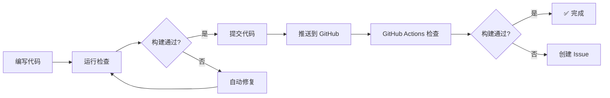

# 自动化构建检查和修复系统

## 📋 概述

本项目已配置自动化构建检查和修复系统，包括：

1. **GitHub Actions 工作流** - 自动检查每次推送的构建状态
2. **自动修复脚本** - 自动修复常见的 TypeScript 类型错误
3. **本地检查脚本** - 在提交前本地检查构建状态

## 🚀 快速开始

### 本地使用

#### 1. 检查构建状态

```bash
# 方式1: 使用 npm 脚本
npm run check:build

# 方式2: 直接运行脚本
./scripts/check-build.sh
```

#### 2. 只检查 TypeScript 类型

```bash
npm run check:types
```

#### 3. 自动修复常见错误

```bash
npm run fix:build
```

### GitHub Actions 自动检查

每次推送到以下分支时，GitHub Actions 会自动运行：

- `feat/language-system`
- `main`
- `master`

**工作流会：**

1. ✅ 运行 TypeScript 类型检查
2. ✅ 运行 Next.js 构建
3. ✅ 上传构建日志作为 Artifact
4. ✅ 如果构建失败，自动创建 GitHub Issue

**查看构建状态：**

1. 访问 GitHub 仓库的 "Actions" 标签页
2. 点击最新的工作流运行
3. 查看构建日志和 Artifact

## 📁 文件结构

```
.github/workflows/
  └── build-check.yml          # GitHub Actions 工作流配置

scripts/
  ├── check-build.sh          # 本地构建检查脚本
  └── auto-fix-build-errors.ts # 自动修复脚本

docs/
  └── AUTO_BUILD_CHECK.md     # 本文档
```

## 🔧 自动修复功能

`auto-fix-build-errors.ts` 脚本可以自动修复以下常见错误：

### 1. 空值检查错误

**错误示例：**
```
Type error: 'xxx' is possibly 'null'
```

**自动修复：**
- 添加可选链操作符 `?.`
- 添加空值合并操作符 `||`

### 2. 未定义调用错误

**错误示例：**
```
Type error: Cannot invoke an object which is possibly 'undefined'
```

**自动修复：**
- 添加可选调用 `?.()`

### 3. ReactNode 类型错误

**错误示例：**
```
Type error: Type 'xxx' is not assignable to type 'ReactNode'
```

**需要手动修复：** 将对象转换为字符串

## 📊 工作流程

### 开发流程



### 检查流程

1. **本地检查**（推荐在提交前运行）
   ```bash
   npm run check:build
   ```

2. **自动修复**（如果发现错误）
   ```bash
   npm run fix:build
   ```

3. **再次检查**（确认修复成功）
   ```bash
   npm run check:build
   ```

4. **提交并推送**
   ```bash
   git add .
   git commit -m "fix: 修复构建错误"
   git push
   ```

## 🎯 最佳实践

### 1. 提交前检查

**强烈建议**在每次提交前运行：

```bash
npm run check:build
```

这样可以：
- ✅ 提前发现构建错误
- ✅ 避免推送失败的构建
- ✅ 节省 CI/CD 时间

### 2. 使用自动修复

如果构建失败，先尝试自动修复：

```bash
npm run fix:build
```

然后再次检查：

```bash
npm run check:build
```

### 3. 查看构建日志

如果自动修复无法解决问题，查看详细日志：

```bash
# 查看 TypeScript 错误
cat typecheck-errors.log

# 查看构建错误
cat build-errors.log
```

### 4. 手动修复复杂错误

对于复杂的类型错误，可能需要：

1. 查看错误详情
2. 理解类型定义
3. 添加类型断言或类型守卫
4. 使用工具函数（如 `getContentText`, `getQuestionOptions`）

## 🔍 常见问题

### Q: 为什么本地构建通过，但 GitHub Actions 失败？

**可能原因：**

1. **环境差异**
   - Node.js 版本不同
   - 依赖版本不同
   - 环境变量缺失

2. **缓存问题**
   - `.next` 缓存不一致
   - `node_modules` 版本不同

**解决方案：**

```bash
# 清理缓存
rm -rf .next node_modules
npm install
npm run build
```

### Q: 自动修复脚本没有修复我的错误？

**原因：**

自动修复脚本只能处理**常见且简单的错误**。复杂错误需要手动修复。

**解决方案：**

1. 查看错误详情
2. 理解类型系统
3. 参考项目中的工具函数
4. 查看类似错误的修复示例

### Q: 如何禁用某些 ESLint 警告？

**方法1：** 在代码中添加注释

```typescript
// eslint-disable-next-line react-hooks/exhaustive-deps
useEffect(() => {
  // ...
}, []);
```

**方法2：** 修改 `eslint.config.js`

```javascript
rules: {
  'react-hooks/exhaustive-deps': 'warn', // 降级为警告
}
```

## 📝 维护说明

### 更新自动修复规则

编辑 `scripts/auto-fix-build-errors.ts`，添加新的修复规则。

### 更新 GitHub Actions

编辑 `.github/workflows/build-check.yml`，修改检查流程。

### 添加新的检查脚本

1. 在 `scripts/` 目录创建新脚本
2. 在 `package.json` 添加 npm 命令
3. 更新本文档

## 🎉 总结

通过自动化构建检查系统，你可以：

- ✅ **提前发现问题** - 在提交前发现构建错误
- ✅ **自动修复** - 常见错误自动修复
- ✅ **持续监控** - GitHub Actions 自动检查
- ✅ **问题追踪** - 自动创建 Issue

**记住：** 在提交前运行 `npm run check:build` 可以节省大量时间！

